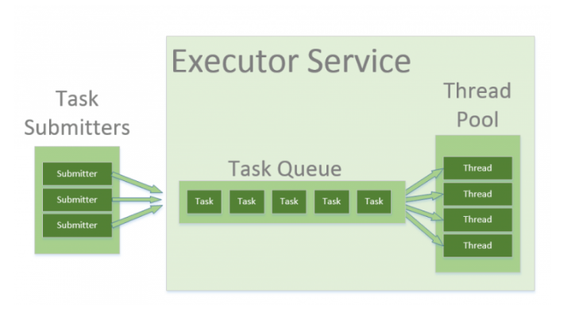
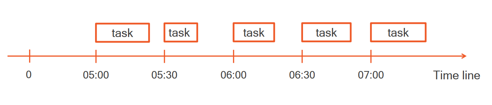
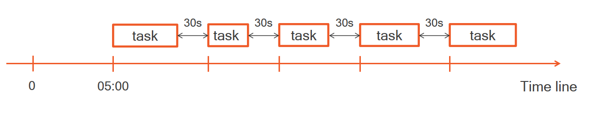
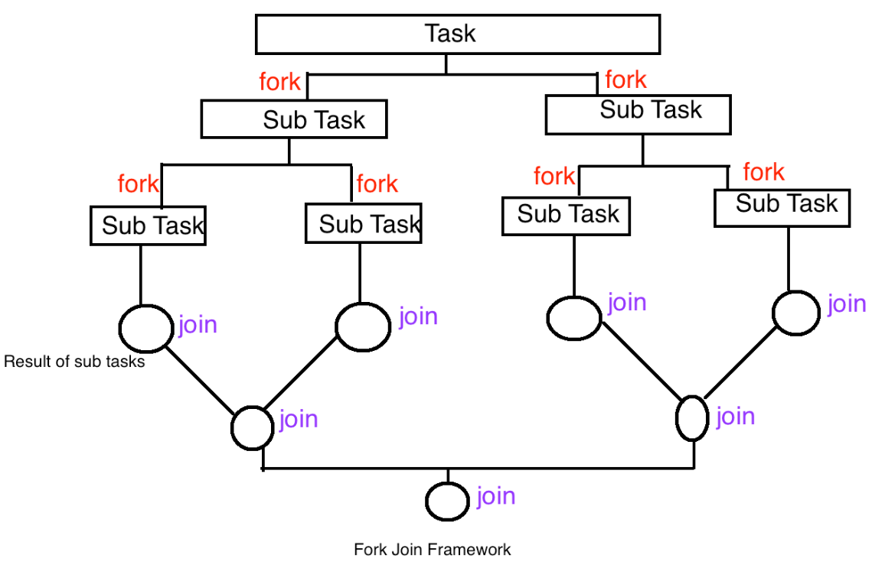

# Advanced Concurrency - Module 1

> This is a tutorials course covering advanced concurrency in Java.

Tools used:

- JDK 11
- Maven
- JUnit 5, Mockito
- IntelliJ IDE

## Table of contents

1. [Executor Pattern, Callable and Future](https://github.com/backstreetbrogrammer/31_AdvancedConcurrency#chapter-01-executor-pattern-callable-and-future)
2. [Fork/Join Framework](https://github.com/backstreetbrogrammer/31_AdvancedConcurrency#chapter-02-forkjoin-framework)

---

### Chapter 01. Executor Pattern, Callable and Future

#### Executor Pattern

The naive way to create a thread and start is by using `Runnable` interface.

Code snippet:

```
final Runnable task = () -> System.out.println("Hello students!");
final Thread thread = new Thread(task);
thread.start();
```

- the thread task is wrapped in an instance of Runnable `run()` method
- Runnable instance is passed to a new instance of Thread in constructor
- Thread is executed by calling `start()`

Downsides of this approach:

- a thread is created on demand by the user - means that any user can create any number of threads in the application
- **problem**: most of the operating systems have a limit to the maximum number of threads which can be created
- once the task is done, i.e. finish the `run()` method => the thread dies
- **problem**: a thread is an expensive resource, and it will impact system performance if too many threads are created
  and finished-terminated at a quick rate

The **Executor Pattern** aims to fix the above-mentioned issues:

- by creating pools of ready-to-use threads
- passing task to this pool of threads that will execute it



```java
public interface Executor {
    void execute(Runnable task);
}
```

A pool of thread is an instance of the `Executor` interface.

```java
public interface ExecutorService extends Executor {
    // 11 more methods
}
```

`ExecutorService` is an extension of `Executor` and has got around 11 more methods. The implementations of both
interfaces are the same. The factory class `Executors` proposes around 20 more methods to **create executors**.

Code snippet to create a single-thread pool:

```
final ExecutorService executor = Executors.newSingleThreadExecutor();
final Runnable task = () -> System.out.println("Hello students!");

// Executor pattern
executor.execute(task);

// Runnable pattern
new Thread(task).start();
```

The thread in this pool will be kept alive as long as this pool is alive. It means that the single thread will execute
the submitted task => once the task finishes, the thread will return to the pool and wait for new task to be submitted
for execution.

As compared to Runnable pattern, Executor pattern does NOT create a new thread. However, the behavior is same: both
calls return immediately and task is executed in **another** thread.

We can also create executors with multiple threads in the pool:

```
// fixed thread pool size of 4 threads
final ExecutorService multipleThreadsExecutor = Executors.newFixedThreadPoolExecutor(4);

// cached thread pool where size is dependent on number of system cpu cores available 
// creates new threads as needed, but will reuse previously constructed threads when they are available
final ExecutorService cachedExecutor = Executors.newCachedThreadPool();
```

More about **cached** thread pool:

- create threads **on demand** but will reuse previously constructed threads when they are available
- keeps **unused** threads for **60 seconds** by default, then terminates them

#### Interview Problem 1 (CLSA): Executor Service - Waiting Queue

**Waiting queue**

Suppose we have a code snippet:

```
final Executor executor = Executors.newSingleThreadExecutor();

final Runnable task1 = () -> someLongProcess();
final Runnable task2 = () -> anotherLongProcess();

executor.execute(task1);
executor.execute(task2);
```

When we run this code, **task2** has to wait for **task1** to complete. The executor has a **waiting queue** to handle
this:

- A task is added to the waiting queue when **no** thread is available
- The tasks are executed in the **order** of their submission

**Can we know if a task is done or not?**

**Answer is no** - we don't have any API method in **ExecutorService** to check that. However, we can have a print
statement at the end of our Runnable task (`run()` method) to indicate that task has completed.

**Can we cancel the execution of a task?**

**Answer is yes** - BUT only if the task has NOT started yet and still in the waiting queue.

To summarize the advantages of using **Executor Pattern**:

- building an executor is **more performance efficient** than creating threads on demand
- can pass instances of Runnable to an executor - even if there are no threads available in the pool, executor has a
  waiting queue to **handle more tasks** than number of threads in the pool
- a task can be **cancelled** by removing it from the waiting queue

#### Callable and Future

There are some caveats in `Runnable` interface:

```java

@FunctionalInterface
public interface Runnable {
    void run();
}
```

There is no way we can know if a task is done or not.

- No object can be returned
- No exception can be raised

We need to know if there was any exception raised by the task, and also we may need flexibility to get a value returned
from the task.

In Java 1.5 release, new `Callable` interface was introduced:

```java

@FunctionalInterface
public interface Callable<V> {
    V call() throws Exception;
}
```

As seen, `Callable` can return `V` object and also throws `Exception` (if any) to the calling thread.

We can use it via `submit()` method in `ExecutorService` which returns a `Future` object:

```
<T> Future<T> submit(Callable<T> task);
```

Sample code snippet:

```
// In the main thread
final ExecutorService executor = Executors.newFixedThreadPoolExecutor(4);
final Callable<String> task = () -> someTaskWhichReturnsString();

final Future<String> future = executor.submit(task); // asynchronous
// optionally, main thread can do some other task here
// ...
final String result = future.get(); // get() call is blocking until the returned String is available 
```

More about `Future.get()` method:

- blocking until the returned value `V` is available
- can raise 2 exceptions:
    - if the thread from the thread pool in `ExecutorService` is interrupted => throws `InterruptedException`
    - if the submitted task itself throws an exception => it is wrapped in an `ExecutionException` and re-thrown

We can use overloaded `Future.get()` methods which allows to pass a **timeout** as argument to avoid indefinitely
blocking calls. However, if the value `V` is still not available after the given timeout, it will throw
`TimeoutException`.

Other methods in `Future`:

- **isDone()**: tells us if the executor has finished processing the task. If the task is complete, it will return true;
  otherwise, it returns false.
- **cancel(boolean)**: can be used to tell the executor to stop the operation and interrupt its underlying thread.
- **isCancelled()**: tells us if the task is cancelled or not, returning a boolean.

Now as we have learnt basics of `Callable` and `Future`, let's explore more methods available in `Executor`.

ExecutorService can execute both `Runnable` and `Callable` tasks.

Example code snippet:

```
final Runnable runnableTask = () -> {
    try {
        TimeUnit.MILLISECONDS.sleep(300L);
        System.out.println("Hello students from Runnable!");
    } catch (final InterruptedException e) {
        e.printStackTrace();
    }
};

final Callable<String> callableTask = () -> {
    TimeUnit.MILLISECONDS.sleep(300L);
    return "Hello students from Callable!";
};

final List<Callable<String>> callableTasks = List.of(callableTask, callableTask, callableTask);
final ExecutorService executorService = Executors.newFixedThreadPoolExecutor(2);
```

We can call following methods:

- **execute()**: method is `void` and doesn't give any possibility to get the result of a task's execution or to check
  the task's status (if it is running):
    - `executorService.execute(runnableTask);`
- **submit()**: submits a `Callable` or a `Runnable` task to an `ExecutorService` and returns a result of type `Future`:
    - `Future<String> future = executorService.submit(callableTask);`
    - `Future<?> future = executorService.submit(runnableTask);` // Future's `get()` method will return `null` upon
      successful completion
- **invokeAny()**: assigns a collection of tasks to an `ExecutorService`, causing each to run, and returns the result of
  a successful execution of **one** task (if there was a successful execution)
    - `String result = executorService.invokeAny(callableTasks);`
- **invokeAll()**: assigns a collection of tasks to an `ExecutorService`, causing each to run, and returns the result of
  **all** task executions in the form of a list of objects of type `Future`
    - `List<Future<String>> futures = executorService.invokeAll(callableTasks);`

**Shutting Down an ExecutorService**

The `ExecutorService` will not be automatically destroyed when there is no task to process. It will stay alive and wait
for new work to do. So, the application or main thread will not terminate as the threads in the executor's thread pool
are **non-daemon** which will keep the application alive.

To properly shut down an `ExecutorService`, we have the `shutdown()` and `shutdownNow()` methods.

- **shutdown()**: method doesn't cause immediate destruction of the `ExecutorService`. It will make the
  `ExecutorService` stop accepting new tasks and shut down after all running threads finish their current work.
    - `executorService.shutdown();`
- **shutdownNow()**: method tries to destroy the `ExecutorService` immediately, but it doesn't guarantee that all the
  running threads will be stopped at the same time.
    - `List<Runnable> notExecutedTasks = executorService.shutDownNow();` // This method returns a list of tasks that are
      waiting to be processed. It is up to the developer to decide what to do with these tasks.

**Oracle** recommended way to shut down the `ExecutorService` using `awaitTermination()` method:

```
executorService.shutdown();
try {
    if (!executorService.awaitTermination(900L, TimeUnit.MILLISECONDS)) {
        executorService.shutdownNow();
    } 
} catch (final InterruptedException e) {
    executorService.shutdownNow();
}
```

`ExecutorService` will first stop taking new tasks and then wait up to a specified period of time (900 ms) for all tasks
to be completed. If that time expires, the execution is stopped immediately.

#### Interview Problem 2 (Merrill Lynch): Implement GCD algorithm using Executor Service and Futures

Greatest Common Divisor (GCD) of two or more integers is the largest integer that divides each of the integers such that
their remainder is zero.

Example:

- GCD of 20, 30 = 10  (10 is the largest number which divides 20 and 30 with remainder as 0)
- GCD of 42, 120, 285 = 3  (3 is the largest number which divides 42, 120 and 285 with remainder as 0)

Pseudo Code of the Euclidean Algorithm to find GCD of 2 numbers:

- Step 1:  Let `a, b` be the two numbers
- Step 2:  `a mod b = R`
- Step 3:  Let `a = b` and `b = R`
- Step 4:  Repeat Steps 2 and 3 until `a mod b` is greater than `0`
- Step 5:  `GCD = a`
- Step 6: Finish

Write the GCD algorithm in Java using Executor Service and Futures.

**Solution**:

Let's implement the GCD algorithm as given in the pseudocode:

```
    // Euclidean Algorithm
    private static int gcd(final int a, final int b) {
        if (b == 0)
            return a;

        return gcd(b, a % b);
    }
```

Complete code using Futures:

```java
import java.util.concurrent.*;

public class GCDCalculator {

    private final ExecutorService executor = Executors.newFixedThreadPool(2);

    public Future<Integer> calculate(final int a, final int b) {
        return executor.submit(() -> {
            TimeUnit.MILLISECONDS.sleep(1000L);
            return gcd(a, b);
        });
    }

    // Euclidean Algorithm
    private static int gcd(final int a, final int b) {
        if (b == 0)
            return a;

        return gcd(b, a % b);
    }

    private void shutdown() {
        executor.shutdown();
    }

    public static void main(final String[] args) throws InterruptedException, ExecutionException {
        final GCDCalculator gcdCalculator = new GCDCalculator();

        final Future<Integer> future1 = gcdCalculator.calculate(20, 30);
        final Future<Integer> future2 = gcdCalculator.calculate(15, 35);

        while (!(future1.isDone() && future2.isDone())) {
            System.out.printf("future1 is %s and future2 is %s%n",
                              future1.isDone() ? "done" : "not done",
                              future2.isDone() ? "done" : "not done");
            TimeUnit.MILLISECONDS.sleep(300L);
        }

        final Integer result1 = future1.get();
        final Integer result2 = future2.get();

        System.out.printf("GCD of (20,30) is %d%n", result1);
        System.out.printf("GCD of (15,35) is %d%n", result2);

        gcdCalculator.shutdown();
    }
}
```

Output:

```
future1 is not done and future2 is not done
future1 is not done and future2 is not done
future1 is not done and future2 is not done
future1 is not done and future2 is not done
GCD of (20,30) is 10
GCD of (15,35) is 5
```

**ScheduledExecutorService**

The `ScheduledExecutorService` runs tasks after some predefined delay and/or periodically. We can create a new
`ScheduledExecutorService` instance using the `Executors` factory method:

```
ScheduledExecutorService executorService = Executors.newSingleThreadScheduledExecutor();
```

Methods available:

- **schedule()**: schedule a single task's execution after a fixed delay; tasks can be `Callable` or `Runnable`
    - `Future<String> resultFuture = executorService.schedule(callableTask, 1, TimeUnit.SECONDS);` // delays for one
      second before executing **callableTask**
- **scheduleAtFixedRate()**: schedule a single task's execution after a fixed delay and then keep on running at a fixed
  rate. Following block of code will run a task after an initial delay of 100 ms and after that, it will run the same
  task every 450 ms:
    - `executorService.scheduleAtFixedRate(runnableTask, 100L, 450L, TimeUnit.MILLISECONDS);`



- **scheduleWithFixedDelay()**: if it is necessary to have a fixed length delay between iterations of the task.
  Following code will guarantee a 150 ms pause between the end of the current execution and the start of another one:
    - `executorService.scheduleWithFixedDelay(task, 100, 150, TimeUnit.MILLISECONDS);`



**Few common pitfalls of ExecutorService**

- Keeping an unused `ExecutorService` alive: We need to be careful and shut down an ExecutorService, otherwise the
  application will keep on running even if it has completed.
- Wrong thread-pool capacity while using fixed length thread pool: It is very important to determine how many threads
  the application will need to run tasks efficiently. A too-large thread pool will cause unnecessary overhead just to
  create threads that will mostly be in the waiting mode. Too few can make an application seem unresponsive because of
  long waiting periods for tasks in the queue.
- Calling a Future‘s `get()` method after task cancellation: Attempting to get the result of an already canceled task
  triggers a `CancellationException`.
- Unexpectedly long blocking with Future‘s `get()` method: We should use timeouts to avoid unexpected waits.

---

### Chapter 02. Fork/Join Framework

The Fork/Join Framework was designed to recursively split a parallelizable task into smaller tasks and then combine the
results of each subtask to produce the overall result. It provides tools to help speed up parallel processing by
attempting to use all available processor cores. It accomplishes this through a divide and conquer approach.

Pseudo code:

```
if (task is small enough or no longer divisible) {
    compute task sequentially
} else {
    split task in 2 subtasks
    call this method recursively possibly further splitting each subtask
    wait for the completion of all subtasks
    combine the results of each subtask
}
```



In practice, this means that the framework first **"forks"** recursively breaking the task into smaller independent
subtasks until they are simple enough to run asynchronously.

After that, the **"join"** part begins. The results of all subtasks are recursively joined into a single result. In the
case of a task that returns `void`, the program simply waits until every subtask runs.

To provide effective parallel execution, the fork/join framework uses a pool of threads called the `ForkJoinPool`. This
pool manages worker threads of type `ForkJoinWorkerThread`.

**ExecutorService vs Fork/Join**

Fork/Join framework is an implementation of the `ExecutorService` interface for parallel execution.

After the release of Java 7, many developers decided to replace the `ExecutorService` framework with the **Fork/Join
framework**.

However, despite the simplicity and frequent performance gains associated with fork/join, it reduces developer control
over concurrent execution.

`ExecutorService` gives the developer the ability to control the number of generated threads and the granularity of
tasks that should be run by separate threads. The best use case for `ExecutorService` is the processing of
**independent** tasks, such as transactions or requests according to the scheme **"one thread for one task"**.

In contrast, **fork/join** was designed to speed up work that can be broken into smaller pieces recursively. For
example: parallel merge sort, parallel maximum finding etc.

**RecursiveTask<T>**

`RecursiveTask<T>` returns a generic `T` type.

All the tasks we want to execute in parallel is a **subclass** of this class. We have to override the `compute()` method
that will return the solution of the sub-problem.

**RecursiveAction**

`RecursiveAction` is a task but without any return value.

**ForkJoinPool**

`ForkJoinPool` is a thread-pool for executing fork-join tasks. Number of threads is usually the number of CPU cores.
These threads use **"work-stealing"** algorithm => it can **"steal"** tasks from other busy threads if done with its own
tasks.

Main point to note is that a task is **NOT** equivalent to a thread! Tasks are lightweight threads so fork-join will be
efficient even when there are a huge number of tasks.

Fork/Join Framework can handle the problem of **load-balancing** quite efficiently.

**Example 1**

Simple example to demonstrate `RecursiveAction`

```
    /*
        fork()   - asynchronous execution of tasks in the pool
                   we call it when using RecursiveTask<T> or RecursiveAction
        join()   - returns the result when the computation is finished
        invoke() - synchronous execution of the given tasks + wait + return the result upon completion
     */
```

Using **fork-join**:

```java
import java.util.concurrent.RecursiveAction;

public class SimpleRecursiveActionForkJoin extends RecursiveAction {
    private final int taskSize;

    public SimpleRecursiveActionForkJoin(final int taskSize) {
        this.taskSize = taskSize;
    }

    @Override
    protected void compute() {
        // if the task is large, split it and execute in parallel
        if (taskSize > 100) {
            System.out.printf("[%s] Split the tasks [taskSize=%d] and execute in parallel%n",
                              Thread.currentThread().getName(), taskSize);
            final SimpleRecursiveActionForkJoin action1 = new SimpleRecursiveActionForkJoin(taskSize / 2);
            final SimpleRecursiveActionForkJoin action2 = new SimpleRecursiveActionForkJoin(taskSize / 2);

            action1.fork();
            action2.fork();

            action1.join();
            action2.join();
        } else {
            System.out.printf("[%s] Task [taskSize=%d] is small to be executed in sequence%n", Thread.currentThread().getName(), taskSize);
            task();
        }
    }

    private void task() {
        // it can be any complex task or algorithm
        System.out.printf("[%s] The size of the task is %d%n", Thread.currentThread().getName(), taskSize);
    }
}
```

Test class:

```java
import org.junit.jupiter.api.DisplayName;
import org.junit.jupiter.params.ParameterizedTest;
import org.junit.jupiter.params.provider.ValueSource;

public class SimpleRecursiveActionForkJoinTest {

    @ParameterizedTest
    @ValueSource(ints = {
            400,
            70
    })
    @DisplayName("Test RecursiveAction with different task sizes using fork-join")
    void testRecursiveActionWithDifferentTaskSizesUsingForkJoin(final int taskSize) {
        final SimpleRecursiveActionForkJoin action = new SimpleRecursiveActionForkJoin(taskSize);
        action.invoke();
        System.out.println("------------------------\n");
    }
}
```

Output:

```
[main] Split the tasks [taskSize=400] and execute in parallel
[ForkJoinPool.commonPool-worker-3] Split the tasks [taskSize=200] and execute in parallel
[ForkJoinPool.commonPool-worker-5] Split the tasks [taskSize=200] and execute in parallel
[ForkJoinPool.commonPool-worker-5] Task [taskSize=100] is small to be executed in sequence
[ForkJoinPool.commonPool-worker-3] Task [taskSize=100] is small to be executed in sequence
[ForkJoinPool.commonPool-worker-3] The size of the task is 100
[ForkJoinPool.commonPool-worker-7] Task [taskSize=100] is small to be executed in sequence
[ForkJoinPool.commonPool-worker-7] The size of the task is 100
[ForkJoinPool.commonPool-worker-5] The size of the task is 100
[ForkJoinPool.commonPool-worker-3] Task [taskSize=100] is small to be executed in sequence
[ForkJoinPool.commonPool-worker-3] The size of the task is 100
------------------------

[main] Task [taskSize=70] is small to be executed in sequence
[main] The size of the task is 70
------------------------
```

Using **invoke**:

```java
import java.util.concurrent.RecursiveAction;

public class SimpleRecursiveActionInvokeAll extends RecursiveAction {
    private final int taskSize;

    public SimpleRecursiveActionInvokeAll(final int taskSize) {
        this.taskSize = taskSize;
    }

    @Override
    protected void compute() {
        // if the task is large, split it and execute in parallel
        if (taskSize > 100) {
            System.out.printf("[%s] Split the tasks [taskSize=%d] and execute in parallel%n",
                              Thread.currentThread().getName(), taskSize);
            final SimpleRecursiveActionInvokeAll action1 = new SimpleRecursiveActionInvokeAll(taskSize / 2);
            final SimpleRecursiveActionInvokeAll action2 = new SimpleRecursiveActionInvokeAll(taskSize / 2);

            invokeAll(action1, action2);
        } else {
            System.out.printf("[%s] Task [taskSize=%d] is small to be executed in sequence%n", Thread.currentThread().getName(), taskSize);
            task();
        }
    }

    private void task() {
        // it can be any complex task or algorithm
        System.out.printf("[%s] The size of the task is %d%n", Thread.currentThread().getName(), taskSize);
    }
}
```

Test class:

```java
import org.junit.jupiter.api.DisplayName;
import org.junit.jupiter.params.ParameterizedTest;
import org.junit.jupiter.params.provider.ValueSource;

public class SimpleRecursiveActionInvokeAllTest {

    @ParameterizedTest
    @ValueSource(ints = {
            400,
            70
    })
    @DisplayName("Test RecursiveAction with different task sizes using invokeAll()")
    void testRecursiveActionWithDifferentTaskSizesUsingInvokeAll(final int taskSize) {
        final SimpleRecursiveActionInvokeAll action = new SimpleRecursiveActionInvokeAll(taskSize);
        action.invoke();
        System.out.println("------------------------\n");
    }
}
```

Output:

```
[main] Split the tasks [taskSize=400] and execute in parallel
[main] Split the tasks [taskSize=200] and execute in parallel
[main] Task [taskSize=100] is small to be executed in sequence
[main] The size of the task is 100
[ForkJoinPool.commonPool-worker-3] Task [taskSize=100] is small to be executed in sequence
[ForkJoinPool.commonPool-worker-3] The size of the task is 100
[ForkJoinPool.commonPool-worker-5] Split the tasks [taskSize=200] and execute in parallel
[ForkJoinPool.commonPool-worker-5] Task [taskSize=100] is small to be executed in sequence
[ForkJoinPool.commonPool-worker-5] The size of the task is 100
[ForkJoinPool.commonPool-worker-7] Task [taskSize=100] is small to be executed in sequence
[ForkJoinPool.commonPool-worker-7] The size of the task is 100
------------------------

[main] Task [taskSize=70] is small to be executed in sequence
[main] The size of the task is 70
------------------------
```

#### Interview Problem 3 (Jane Street): Printing integers in parallel

Design a parallel algorithm to print all the integer values in a List.

We can split the array of integers into smaller sub-arrays until there are <2 items left. We can use the sequential
approach with these small sub-arrays.

**Solution**

```java
import java.util.List;
import java.util.concurrent.RecursiveAction;

public class PrintIntegersInParallel extends RecursiveAction {

    private final List<Integer> nums;

    public PrintIntegersInParallel(final List<Integer> nums) {
        this.nums = nums;
    }

    @Override
    protected void compute() {
        // the problem is small enough (containing 2 items) => sequential print operation
        if (nums.size() < 2) {
            for (final Integer num : nums)
                System.out.printf("[%s]num=%d%n", Thread.currentThread().getName(), num);
        } else {
            /* otherwise, we split the problem into 2 sub-problems:
                   [a,b,c] --> [a] and [b,c]
                   [a,b,c,d] --> [a,b] and [c,d]
             */
            final List<Integer> left = nums.subList(0, nums.size() / 2);
            final List<Integer> right = nums.subList(nums.size() / 2, nums.size());

            final PrintIntegersInParallel action1 = new PrintIntegersInParallel(left);
            final PrintIntegersInParallel action2 = new PrintIntegersInParallel(right);

            invokeAll(action1, action2); // or can use fork(), join() too
        }
    }
}
```

Test class:

```java
import org.junit.jupiter.api.Test;

import java.util.stream.Collectors;
import java.util.stream.Stream;

public class PrintIntegersInParallelTest {

    @Test
    void testPrintingIntegersInParallel() {
        final var myList = Stream.iterate(1, n -> n + 1)
                                 .limit(10L)
                                 .collect(Collectors.toList());
        final PrintIntegersInParallel printAction = new PrintIntegersInParallel(myList);
        printAction.invoke();
    }
}
```

Sample output:

```
[main]num=1
[ForkJoinPool.commonPool-worker-7]num=2
[ForkJoinPool.commonPool-worker-7]num=4
[ForkJoinPool.commonPool-worker-5]num=6
[ForkJoinPool.commonPool-worker-7]num=5
[ForkJoinPool.commonPool-worker-3]num=3
[ForkJoinPool.commonPool-worker-7]num=8
[ForkJoinPool.commonPool-worker-5]num=7
[ForkJoinPool.commonPool-worker-7]num=10
[ForkJoinPool.commonPool-worker-3]num=9
```

**Example 2**

Simple example to demonstrate `RecursiveTask<T>`

```java
import java.util.concurrent.RecursiveTask;

public class SimpleRecursiveTask extends RecursiveTask<Double> {
    private final double num;

    public SimpleRecursiveTask(final double num) {
        this.num = num;
    }

    @Override
    protected Double compute() {
        // if the number is large, split it and execute in parallel
        if (num > 100D) {
            System.out.printf("[%s] Split the tasks [num=%.2f] and execute in parallel%n",
                              Thread.currentThread().getName(), num);
            final SimpleRecursiveTask task1 = new SimpleRecursiveTask(num / 2);
            final SimpleRecursiveTask task2 = new SimpleRecursiveTask(num / 2);

            task1.fork();
            task2.fork();

            // wait for the tasks to complete
            double subResult = 0D;
            subResult += task1.join();
            subResult += task2.join();

            return subResult;
        } else {
            System.out.printf("[%s] Task [num=%.2f] is small to be executed in sequence%n",
                              Thread.currentThread().getName(), num);
            return task();
        }
    }

    private Double task() {
        // it can be any complex task or algorithm
        final double result = num * num;
        System.out.printf("[%s] The square of the num %.2f is %.2f%n", Thread.currentThread().getName(), num, result);
        return result;
    }
}
```

Test class:

```java
import org.junit.jupiter.api.DisplayName;
import org.junit.jupiter.params.ParameterizedTest;
import org.junit.jupiter.params.provider.ValueSource;

import java.util.concurrent.ForkJoinPool;

public class SimpleRecursiveTaskTest {

    @ParameterizedTest
    @ValueSource(doubles = {
            400D,
            70D
    })
    @DisplayName("Test RecursiveTask using fork-join")
    void testRecursiveTaskUsingForkJoin(final double num) {
        final ForkJoinPool pool = new ForkJoinPool();
        final SimpleRecursiveTask task = new SimpleRecursiveTask(num);
        final double squareOfNum = pool.invoke(task);
        System.out.printf("%.2f%n------------------------%n%n", squareOfNum);
    }

}
```

Sample output:

```
[ForkJoinPool-1-worker-3] Split the tasks [num=400.00] and execute in parallel
[ForkJoinPool-1-worker-3] Split the tasks [num=200.00] and execute in parallel
[ForkJoinPool-1-worker-3] Task [num=100.00] is small to be executed in sequence
[ForkJoinPool-1-worker-3] The square of the num 100.00 is 10000.00
[ForkJoinPool-1-worker-3] Task [num=100.00] is small to be executed in sequence
[ForkJoinPool-1-worker-3] The square of the num 100.00 is 10000.00
[ForkJoinPool-1-worker-5] Split the tasks [num=200.00] and execute in parallel
[ForkJoinPool-1-worker-5] Task [num=100.00] is small to be executed in sequence
[ForkJoinPool-1-worker-5] The square of the num 100.00 is 10000.00
[ForkJoinPool-1-worker-1] Task [num=100.00] is small to be executed in sequence
[ForkJoinPool-1-worker-1] The square of the num 100.00 is 10000.00
40000.00
------------------------

[ForkJoinPool-2-worker-3] Task [num=70.00] is small to be executed in sequence
[ForkJoinPool-2-worker-3] The square of the num 70.00 is 4900.00
4900.00
------------------------
```

#### Interview Problem 4 (Jane Street): Fibonacci-numbers

Design a parallel algorithm to calculate the n-th Fibonacci-numbers.

```
F(N) = F(N-1) + F(N-2) 
```

This is recursive formula we can use.

**Solution**

Main solution class:

```java
import java.util.concurrent.RecursiveTask;

public class FibonacciTask extends RecursiveTask<Long> {

    private final long num;

    public FibonacciTask(final long num) {
        this.num = num;
    }

    @Override
    protected Long compute() {
        // F(0) = F(1) = 0
        if (num <= 1L)
            return num;

        // F(N) = F(N-1) + F(N-2)
        final FibonacciTask fib1 = new FibonacciTask(num - 1);
        final FibonacciTask fib2 = new FibonacciTask(num - 2);

        fib1.fork();
        fib2.fork();

        return fib1.join() + fib2.join();
    }
}
```

However, we can do some thread optimisations by just using the same calling thread to compute.

```java
import java.util.concurrent.RecursiveTask;

public class OptimisedFibonacciTask extends RecursiveTask<Long> {

    private final long num;

    public OptimisedFibonacciTask(final long num) {
        this.num = num;
    }

    @Override
    protected Long compute() {
        // F(0) = F(1) = 0
        if (num <= 1L)
            return num;

        // F(N) = F(N-1) + F(N-2)
        final OptimisedFibonacciTask fib1 = new OptimisedFibonacciTask(num - 1);
        final OptimisedFibonacciTask fib2 = new OptimisedFibonacciTask(num - 2);

        fib2.fork();

        return fib1.compute() + fib2.join();
    }
}
```

Test class:

```java
import org.junit.jupiter.api.BeforeEach;
import org.junit.jupiter.api.DisplayName;
import org.junit.jupiter.params.ParameterizedTest;
import org.junit.jupiter.params.provider.ValueSource;

import java.util.concurrent.ForkJoinPool;

public class FibonacciTaskTest {

    private ForkJoinPool pool;

    @BeforeEach
    void setUp() {
        pool = new ForkJoinPool();
    }

    @ParameterizedTest
    @ValueSource(longs = {
            25L,
            10L,
            6L
    })
    @DisplayName("Test to calculate the n-th Fibonacci-numbers")
    void testCalculateNthFibonacciNumber(final long num) {
        final FibonacciTask task = new FibonacciTask(num);
        final long nthFibNum = pool.invoke(task);
        System.out.printf("[%d]th Fibonacci Number = [%d]%n------------------------%n%n", num, nthFibNum);
    }

    @ParameterizedTest
    @ValueSource(longs = {
            25L,
            10L,
            6L
    })
    @DisplayName("Test to calculate the n-th Fibonacci-numbers in optimised way")
    void testCalculateNthFibonacciNumberOptimised(final long num) {
        final OptimisedFibonacciTask task = new OptimisedFibonacciTask(num);
        final long nthFibNum = pool.invoke(task);
        System.out.printf("[%d]th Fibonacci Number = [%d]%n------------------------%n%n", num, nthFibNum);
    }

}
```

Sample Output for both the test cases:

```
[25]th Fibonacci Number = [75025]
------------------------

[10]th Fibonacci Number = [55]
------------------------

[6]th Fibonacci Number = [8]
------------------------
```

#### Interview Problem 5 (JP Morgan): Maximum Finding

Design an algorithm to find the maximum element in a given list of numbers.

**Follow up**: Can we design a parallel algorithm to find the maximum element and have better time complexity than O(n)?

**Solution**

We can do a linear search and find the maximum in a given list of numbers which are NOT sorted.

```java
public class SequentialMaxFinding {
    private final long[] nums;

    public SequentialMaxFinding(final long[] nums) {
        this.nums = nums;
    }

    // Time complexity: O(n)
    // assumption: nums[] is not sorted
    public long max() {
        long max = nums[0];
        for (int i = 1; i < nums.length; i++) {
            if (nums[i] > max) {
                max = nums[i];
            }
        }
        return max;
    }
}
```

Sorting an array will require `O(n * logn)` time complexity which is greater than `O(n)`. Thus, we can NOT apply binary
search to find the maximum.

Using fork-join framework:

```java
import java.util.concurrent.RecursiveTask;

public class ParallelMaxFinding extends RecursiveTask<Long> {
    private final long[] nums;
    private final int lowIndex;
    private final int highIndex;

    public ParallelMaxFinding(final long[] nums, final int lowIndex, final int highIndex) {
        this.nums = nums;
        this.lowIndex = lowIndex;
        this.highIndex = highIndex;
    }

    @Override
    protected Long compute() {
        // if the array is small - we can use sequential max finding algorithm
        if ((highIndex - lowIndex) < 5000) {
            return sequentialMaxFinding();
        } else {
            // use parallelization
            final int middleIndex = lowIndex + (highIndex - lowIndex) / 2;
            final ParallelMaxFinding task1 = new ParallelMaxFinding(nums, lowIndex, middleIndex);
            final ParallelMaxFinding task2 = new ParallelMaxFinding(nums, middleIndex + 1, highIndex);

            invokeAll(task1, task2);

            return Math.max(task1.join(), task2.join());
        }
    }

    // Time complexity: O(n)
    // assumption: nums[] is not sorted
    public Long sequentialMaxFinding() {
        long max = nums[lowIndex];
        for (int i = lowIndex + 1; i < highIndex; i++) {
            if (nums[i] > max) {
                max = nums[i];
            }
        }
        return max;
    }
}
```

Test class:

```java
import org.junit.jupiter.api.BeforeAll;
import org.junit.jupiter.api.DisplayName;
import org.junit.jupiter.api.Test;

import java.time.Duration;
import java.time.Instant;
import java.util.concurrent.ForkJoinPool;
import java.util.concurrent.ThreadLocalRandom;

public class ParallelMaxFindingTest {

    private static final int dataSize = 500_000_000;
    private static final long[] data = new long[dataSize];
    private final int noOfIterations = 10;

    @BeforeAll
    static void beforeAll() {
        for (int i = 0; i < dataSize; i++) {
            data[i] = ThreadLocalRandom.current().nextLong(dataSize);
        }
    }

    @Test
    @DisplayName("Test SequentialMaxFinding")
    void testSequentialMaxFinding() {
        final SequentialMaxFinding maxFinding = new SequentialMaxFinding(data);
        final var start = Instant.now();
        long max = 0L;
        for (int i = 0; i < noOfIterations; i++) {
            max = maxFinding.max();
        }
        final long timeElapsed = (Duration.between(start, Instant.now()).toMillis()) / noOfIterations;
        System.out.printf("[SequentialMaxFinding] time taken: %d ms for size: %d; MAX=[%d]%n%n",
                          timeElapsed, dataSize, max);
        System.out.println("---------------------------------------");
    }

    @Test
    @DisplayName("Test ParallelMaxFinding")
    void testParallelMaxFinding() {
        final ForkJoinPool pool = new ForkJoinPool(Runtime.getRuntime().availableProcessors());
        final ParallelMaxFinding maxFinding = new ParallelMaxFinding(data, 0, data.length);
        final var start = Instant.now();
        long max = 0L;
        for (int i = 0; i < noOfIterations; i++) {
            max = pool.invoke(maxFinding);
        }
        final long timeElapsed = (Duration.between(start, Instant.now()).toMillis()) / noOfIterations;
        System.out.printf("[ParallelMaxFinding] time taken: %d ms for size: %d; MAX=[%d]%n%n",
                          timeElapsed, dataSize, max);
        System.out.println("---------------------------------------");
    }

}
```

Sample output:

```
[SequentialMaxFinding] time taken: 373 ms for size: 500000000; MAX=[499999999]

---------------------------------------
[ParallelMaxFinding] time taken: 38 ms for size: 500000000; MAX=[499999999]

---------------------------------------
```

#### Interview Problem 6 (Societe Generale): Merge Sort

Implement merge sort algorithm.

**Follow up**: Can we design a parallel algorithm for merge sort?

**Solution**

Sequential merge sort algorithm - Time Complexity: `O(n * logn)`

```java
import java.util.Arrays;

public class SequentialMergeSort {

    private final long[] nums;

    public SequentialMergeSort(final long[] nums) {
        this.nums = nums;
    }

    public void sequentialMergeSort() {
        mergeSort(nums);
    }

    private void mergeSort(final long[] nums) {
        if (nums.length <= 1) {
            return;
        }

        final int middleIndex = nums.length / 2;

        final long[] left = Arrays.copyOfRange(nums, 0, middleIndex);
        final long[] right = Arrays.copyOfRange(nums, middleIndex + 1, nums.length);

        mergeSort(left);
        mergeSort(right);

        merge(left, right, nums);
    }

    private void merge(final long[] leftSubArray, final long[] rightSubArray, final long[] originalArray) {
        int i = 0, j = 0, k = 0;

        while (i < leftSubArray.length && j < rightSubArray.length) {
            if (leftSubArray[i] < rightSubArray[j]) {
                originalArray[k++] = leftSubArray[i++];
            } else {
                originalArray[k++] = rightSubArray[j++];
            }
        }

        while (i < leftSubArray.length) {
            originalArray[k++] = leftSubArray[i++];
        }

        while (j < rightSubArray.length) {
            originalArray[k++] = rightSubArray[j++];
        }
    }
}
```

Parallel Merge Sort

```java
import java.util.Arrays;
import java.util.concurrent.RecursiveAction;

public class ParallelMergeSort extends RecursiveAction {

    private final long[] nums;

    public ParallelMergeSort(final long[] nums) {
        this.nums = nums;
    }

    @Override
    protected void compute() {
        if (nums.length <= 5000) {
            // sequential merge sort
            mergeSort(nums);
            return;
        }

        final int middleIndex = nums.length / 2;
        final long[] left = Arrays.copyOfRange(nums, 0, middleIndex);
        final long[] right = Arrays.copyOfRange(nums, middleIndex + 1, nums.length);

        final ParallelMergeSort task1 = new ParallelMergeSort(left);
        final ParallelMergeSort task2 = new ParallelMergeSort(right);

        invokeAll(task1, task2);

        merge(left, right, nums);
    }

    private void mergeSort(final long[] nums) {
        if (nums.length <= 1) {
            return;
        }

        final int middleIndex = nums.length / 2;

        final long[] left = Arrays.copyOfRange(nums, 0, middleIndex);
        final long[] right = Arrays.copyOfRange(nums, middleIndex + 1, nums.length);

        mergeSort(left);
        mergeSort(right);

        merge(left, right, nums);
    }

    private void merge(final long[] leftSubArray, final long[] rightSubArray, final long[] originalArray) {
        int i = 0, j = 0, k = 0;

        while (i < leftSubArray.length && j < rightSubArray.length) {
            if (leftSubArray[i] < rightSubArray[j]) {
                originalArray[k++] = leftSubArray[i++];
            } else {
                originalArray[k++] = rightSubArray[j++];
            }
        }

        while (i < leftSubArray.length) {
            originalArray[k++] = leftSubArray[i++];
        }

        while (j < rightSubArray.length) {
            originalArray[k++] = rightSubArray[j++];
        }
    }
}
```

Test class:

```java
import org.junit.jupiter.api.BeforeAll;
import org.junit.jupiter.api.DisplayName;
import org.junit.jupiter.api.Test;

import java.time.Duration;
import java.time.Instant;
import java.util.concurrent.ForkJoinPool;
import java.util.concurrent.ThreadLocalRandom;

public class ParallelMergeSortTest {
    private static final int dataSize = 100_000_000;
    private static final long[] data = new long[dataSize];

    @BeforeAll
    static void beforeAll() {
        for (int i = 0; i < dataSize; i++) {
            data[i] = ThreadLocalRandom.current().nextLong(dataSize);
        }
    }

    @Test
    @DisplayName("Test SequentialMergeSort")
    void testSequentialMergeSort() {
        final SequentialMergeSort mergeSort = new SequentialMergeSort(data);
        final var start = Instant.now();
        mergeSort.sequentialMergeSort();
        final long timeElapsed = (Duration.between(start, Instant.now()).toMillis());
        System.out.printf("[SequentialMergeSort] time taken: %d ms to sort array of size: %d%n%n",
                          timeElapsed, dataSize);
        System.out.println("---------------------------------------");
    }

    @Test
    @DisplayName("Test ParallelMergeSort")
    void testParallelMergeSort() {
        final ForkJoinPool pool = new ForkJoinPool(Runtime.getRuntime().availableProcessors());
        final ParallelMergeSort mergeSort = new ParallelMergeSort(data);
        final var start = Instant.now();
        pool.invoke(mergeSort);
        final long timeElapsed = (Duration.between(start, Instant.now()).toMillis());
        System.out.printf("[ParallelMergeSort] time taken: %d ms to sort array of size: %d%n%n",
                          timeElapsed, dataSize);
        System.out.println("---------------------------------------");
    }
}
```

Sample output:

```
[SequentialMergeSort] time taken: 22946 ms to sort array of size: 100000000

---------------------------------------
[ParallelMergeSort] time taken: 9266 ms to sort array of size: 100000000

---------------------------------------
```

---
